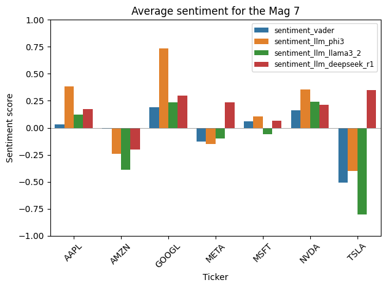

# Mag 7 AI Sentiment Pipeline

- **Purpose 1:** Test whether AI-specific sentiment in news headlines predicts short-term price movements for the Magnificent 7 (NVDA, MSFT, AAPL, AMZN, GOOGL, META, TSLA).
- **Purpose 2:** Compare small local LLMs (phi3, llama3.2:3b, deepseek-r1:1.5b) on performance for sentiment analysis of those headlines.
- **Purpose 3 (tentative):** Test whether suppliers (e.g. NVDA) or consumers (e.g. META) lead in sentiment-return dynamics (bullwhip analysis).

Phase 1 of the pipeline is live: scrapers run to collect headlines, `run_process.py` applies matching and sentiment, and per-headline scores from VADER and three small LLMs are written to `data/cleaned/processed_*.jsonl` and explored in notebooks to compare backends and ticker-level sentiment patterns.

## Setup

**Option 1: Virtual environment (recommended)**

```bash
python -m venv .venv
.venv\Scripts\activate          # Windows
# source .venv/bin/activate     # macOS/Linux
pip install -r requirements.txt
```

**Option 2: System Python**

```bash
pip install -r requirements.txt
```

Dependencies (see `requirements.txt`): feedparser, requests, beautifulsoup4, lxml, pyyaml, pandas, numpy, yfinance, vaderSentiment, matplotlib, seaborn, scipy, xgboost, newsapi-python. 


### Ollama (optional, for local LLM sentiment)
Install/pull the models used by the sentiment pipeline:

```bash
ollama pull phi3
ollama pull llama3.2:3b
ollama pull deepseek-r1:1.5b
```

Make sure Ollama is running before running the LLM backends.

### Run without LLMs (VADER only)

```bash
python scripts/run_process.py --backends vader
```

## Config

- **`config/entities_global.yaml`** — Global AI/relevance config: phrases and entities that flag a headline as AI-related, plus regulatory and macro terms. No ticker-specific data.
- **`config/relationships/<ticker>.yaml`** — One file per Mag 7 ticker. Defines identity (company name, aliases), subsidiaries (e.g. Instagram, WhatsApp for META), products, and ecosystem (partners, suppliers, competitors) with optional weights and keywords. Used to match headlines to tickers and to build the context string passed to the LLM for sentiment.
- **NewsAPI:** Put your API key in `config/secrets.env` (copy from `config/secrets.env.example`). Do not commit `secrets.env`; it is gitignored.

## Sources

Headlines come from three sources:

1. **TechCrunch** (RSS) - no API key required.
2. **NewsAPI Tech** (Top Headlines, category=technology) - requires API key in `config/secrets.env`.
3. **Google News** (RSS, artificial intelligence topic) - no API key required.


## Process: Workflows + Local

**Automated (GitHub Actions)**  
Two workflows keep raw headlines and the aggregated master file updated:

1. **Run scrapers** (schedule or manual) — Runs `scripts/run_all_scrapers.py`; writes `data/raw/headlines_YYYYMMDD_HH.jsonl`, then commits and pushes. Optionally uploads an artifact.
2. **Update headlines master** — Runs after scrapers complete (with a delay). Runs `scripts/headlines_master_orig.py`; merges all raw files into `data/cleaned/headlines_master_orig.jsonl`, then commits and pushes.

**Local (manual)**  
3. **Run processing locally** — Run `python scripts/run_process.py` (or `--backends vader` for VADER-only) to read the latest `data/raw/headlines_*.jsonl`, apply matching + sentiment, and write `data/cleaned/processed_<suffix>.jsonl`.

4. 
Additional details:

- Output columns currently include `sentiment_vader`, `sentiment_llm_phi3`, `sentiment_llm_llama3_2`, and `sentiment_llm_deepseek_r1`, all on the [-1, 1] scale.
- Matching uses the YAML configuration in `config/entities_global.yaml` and `config/relationships/*` to derive ticker/AI flags and injects that context into the LLM sentiment prompt.
- You can control which sentiment backends run via `--backends`, e.g. `python scripts/run_process.py --backends vader` for a fast VADER-only test.

## Analysis & notebooks

- **`notebooks/sentiment_analysis.ipynb`**
  - Loads `data/cleaned/processed_master_orig.jsonl` (or the latest `processed_*.jsonl`) into a Pandas DataFrame.
  - Computes ticker-level average sentiment across all headlines and an AI-related-only subset (`is_ai_related == True`).
  - Visualizes backends with heatmaps and grouped bar charts to compare VADER vs the three LLMs at the ticker level.
  - Includes a section that inspects DeepSeek-R1 versus other models (e.g., on TSLA and META) and prints raw DeepSeek-R1 responses for contrarian headlines to understand its reasoning.

  **Average sentiment per ticker and sentiment score (AI-related headlines):**

  

DeepSeek-R1 has shown more contrarian behavior on some names (e.g., TSLA and META); inspecting its raw responses in the notebook suggests this is due to different but coherent reasoning rather than a pipeline or parsing bug.

## LLM–VADER delta metrics

LLM–VADER deltas are simple per-headline spreads that measure how far each LLM moves away from the VADER baseline on the same [-1, 1] scale. In notebooks, variables such as:

- `phi3_minus_vader = sentiment_llm_phi3 - sentiment_vader`
- `llama_minus_vader = sentiment_llm_llama3_2 - sentiment_vader`
- `deepseek_minus_vader = sentiment_llm_deepseek_r1 - sentiment_vader`

are used to explore disagreement between models. Aggregating these deltas by ticker and/or time (e.g., mean and mean absolute spread per ticker) helps quantify disagreement and model behavior. VADER is treated as a baseline/control, and LLM deltas are used as:

- **Quality checks**: flagging headlines or tickers where LLMs strongly disagree with VADER or with each other.
- **Research features**: candidate inputs for future predictive models alongside raw sentiment scores.

### Planned delta visualizations

Planned delta/spread visualizations include:

- **Per-ticker plots** of mean sentiment per backend alongside mean spread versus VADER.
- **Distribution plots** (histograms or violin plots) of delta values to quantify disagreement across headlines and tickers.
- **Time-series charts** of sentiment and deltas around notable events (once price data is wired in).

These views will support defining confidence regimes (for example, trusting signals more when VADER and LLMs agree in sign and the absolute spread is small) and selecting backends or ensembles for Phase 2 modeling and backtests.

## Next Steps
Looking into analyzing sentiment scores of VADER and the llms and once there's enough time data pulled from the workflow, I'll start looking into a predictive model

## Project layout

```text
mag-7-sentiment-signals/
  config/
    entities_global.yaml          # Global AI buzz phrases/entities, regulatory & macro terms
    relationships/                # One YAML per ticker (AAPL, MSFT, NVDA, etc.)
    secrets.env.example           # Template for optional NewsAPI key
  src/
    scrapers/                     # TechCrunch, NewsAPI Tech, Google News RSS scrapers
      base.py
      techcrunch.py
      google_news_rss.py
      newsapi_tech.py
    matching/                     # Match headlines to tickers and AI relevance (config-driven)
      config_loader.py
      matcher.py
      __init__.py
    sentiment/                    # VADER + Ollama sentiment; analyst prompt and pipeline
      vader_scorer.py
      ollama_scorer.py
      pipeline.py
      __init__.py
    utils.py                      # Shared JSONL and path helpers
  scripts/
    run_all_scrapers.py           # Run all three scrapers and write data/raw/headlines_*.jsonl
    headlines_master_orig.py      # Aggregate all raw into data/cleaned/headlines_master_orig.jsonl
    run_process.py                # raw -> one processed file (match + sentiment)
    database.py                   # SQLite schema and helpers for sentiment_scores.db
  notebooks/
    sentiment_analysis.ipynb      # Main analysis & plots (including sentiment_scores.png)
    sentiment_testing.ipynb       # Earlier/scratch exploration for sentiment & flags
    database_testing.ipynb        # Experiments loading/querying the SQLite DB
    google_news_test.ipynb        # Google News RSS exploration
    newsapi_test.ipynb            # NewsAPI Tech exploration
  data/
    raw/                          # Scraped headlines (headlines_YYYYMMDD_HH.jsonl)
    cleaned/                      # processed_<suffix>.jsonl, headlines_master_orig.jsonl
  visualizations/
    sentiment_scores.png          # Grouped barplot: average sentiment per ticker and model
  .github/
    workflows/
      run-scrapers.yml            # CI: run scrapers on schedule / manual trigger
      headlines_master_orig.yml   # CI: update headlines_master_orig after scrapers
```

