# Mag 7 AI Sentiment Pipeline

- **Purpose 1:** Test whether AI-specific sentiment in news headlines predicts short-term price movements for the Magnificent 7 (NVDA, MSFT, AAPL, AMZN, GOOGL, META, TSLA).
- **Purpose 2:** Compare small local LLMs (phi3, llama3.2:3b, deepseek-r1:1.5b) on performance for sentiment analysis of those headlines.
- **Purpose 3 (tentative):** Test whether suppliers (e.g. NVDA) or consumers (e.g. META) lead in sentiment-return dynamics (bullwhip analysis).

Phase 1 of the pipeline is live: scrapers run to collect headlines, `run_process.py` applies FinBERT and three small LLM sentiment backends, and per-headline scores are written to `data/cleaned/processed_*.jsonl`. Phase 2 analysis is underway: sentiment scores have been aligned with stock price data to test return predictability across multiple horizons.

## Setup

**Option 1: Virtual environment (recommended)**

```bash
python -m venv .venv
.venv\Scripts\activate          # Windows
# source .venv/bin/activate     # macOS/Linux
pip install -r requirements.txt
```

**Option 2: System Python**

```bash
pip install -r requirements.txt
```

Dependencies (see `requirements.txt`): feedparser, requests, beautifulsoup4, lxml, pyyaml, pandas, numpy, yfinance, transformers, torch, matplotlib, seaborn, scipy, xgboost, newsapi-python.


### Ollama (optional, for local LLM sentiment)
Install/pull the models used by the sentiment pipeline:

```bash
ollama pull phi3
ollama pull llama3.2:3b
ollama pull deepseek-r1:1.5b
```

Make sure Ollama is running before running the LLM backends.

### Run without LLMs (FinBERT only)

```bash
python scripts/run_process.py --backends finbert
```

## Config

- **`config/entities_global.yaml`** — Global AI/relevance config: phrases and entities that flag a headline as AI-related, plus regulatory and macro terms. No ticker-specific data.
- **`config/relationships/<ticker>.yaml`** — One file per Mag 7 ticker. Defines identity (company name, aliases), subsidiaries (e.g. Instagram, WhatsApp for META), products, and ecosystem (partners, suppliers, competitors) with optional weights and keywords. Used to match headlines to tickers and to build the context string passed to the LLM for sentiment.
- **NewsAPI:** Put your API key in `config/secrets.env` (copy from `config/secrets.env.example`). Do not commit `secrets.env`; it is gitignored.

## Sources

Headlines come from three sources:

1. **TechCrunch** (RSS) - no API key required.
2. **NewsAPI Tech** (Top Headlines, category=technology) - requires API key in `config/secrets.env`.
3. **Google News** (RSS, artificial intelligence topic) - no API key required.


## Process: Workflows + Local

**Automated (GitHub Actions)**  
Two workflows keep raw headlines and the aggregated master file updated:

1. **Run scrapers** (schedule or manual) — Runs `scripts/run_all_scrapers.py`; appends/merges into `data/raw/headlines_YYYYMMDD.csv` (one file per UTC day; second run that day dedupes by headline+url), then commits and pushes. Optionally uploads an artifact.
2. **Update base data** — Runs after scrapers complete (with a delay). Runs `scripts/base_data.py`: loads all raw files, runs ticker/AI matching, keeps **`is_ai_related == True`**, dedupes on **`(posted_at, url, ticker)`**, writes `data/cleaned/base_data.csv` (full rebuild each run), then commits and pushes.

**Local (manual)**  
3. **Run processing locally** — Run `python scripts/run_process.py` (or `--backends finbert` for FinBERT-only) to read `data/cleaned/base_data.csv`, apply sentiment, and write `data/cleaned/processed_<suffix>.jsonl`.

4. **Legacy JSONL → CSV export** — If you still have old `headlines_*_*.jsonl` files: `python scripts/jsonl_to_csv.py …` / `--all-raw` writes copies under `data/csv/raw/`. New scrapes already save CSV in `data/raw/`.

5. **Normalize per-run CSVs to daily names** — If `data/raw/` has `headlines_YYYYMMDD_HH.csv` exports, run `python scripts/merge_raw_csv_to_daily.py` (optional `--dry-run`) to merge each day into `headlines_YYYYMMDD.csv` and remove the old files.

Additional details:

- Output columns currently include `sentiment_finbert`, `sentiment_llm_phi3`, `sentiment_llm_llama3_2`, and `sentiment_llm_deepseek_r1`, all on the [-1, 1] scale.
- Matching uses the YAML configuration in `config/entities_global.yaml` and `config/relationships/*` to derive ticker/AI flags and injects that context into the LLM sentiment prompt.
- You can control which sentiment backends run via `--backends`, e.g. `python scripts/run_process.py --backends finbert` for a fast FinBERT-only test.

## Analysis & notebooks

- **`notebooks/sentiment_analysis.ipynb`**
  - Loads `data/cleaned/processed_*.jsonl` into a Pandas DataFrame.
  - Computes ticker-level average sentiment across all headlines and an AI-related-only subset (`is_ai_related == True`).
  - Visualizes backends with heatmaps and grouped bar charts to compare FinBERT vs the three LLMs at the ticker level.
  - Includes a section that inspects DeepSeek-R1 versus other models (e.g., on TSLA and META) and prints raw DeepSeek-R1 responses for contrarian headlines to understand its reasoning.

  **Average sentiment per ticker and sentiment score (February 26):**

  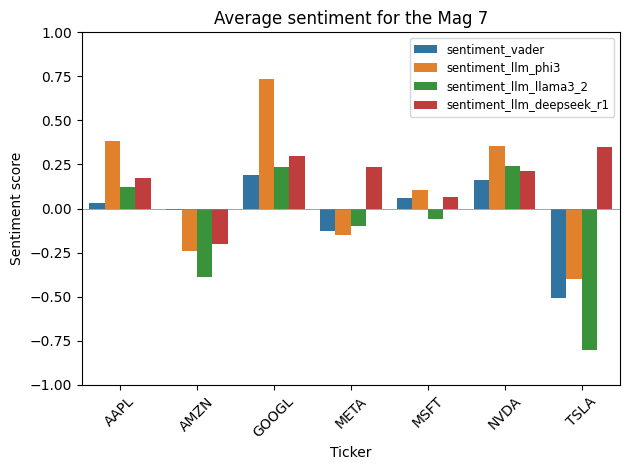

DeepSeek-R1 has shown more contrarian behavior on some names (e.g., TSLA and META); inspecting its raw responses in the notebook suggests this is due to different but coherent reasoning rather than a pipeline or parsing bug.

---

- **`notebooks/sentiment_timeseries - small.ipynb`**
  - Aligns daily-averaged sentiment scores with stock price data (via `yfinance`) using `pd.merge_asof` to map each sentiment event to the next available trading day.
  - Calculates EOD, 1D, 3D, 5D, and 7D forward returns for each ticker, plus excess returns (ticker return minus cross-ticker market average) to isolate the sentiment signal from broad market trends.
  - Runs four analyses:

  **1. Correlation Analysis**
  Computes per-ticker, per-model Pearson correlations between daily-average sentiment and forward returns across all five horizons.
  - Short-horizon sentiment is broadly contrarian — positive headlines are consistently followed by next-day underperformance, consistent with a "buy the rumor, sell the news" dynamic where traders position ahead of expected good news and sell into the headline
  - AAPL is the clearest delayed-positive signal, negative at 1D but strongly positive at 3D–7D across multiple models
  - MSFT and AMZN are persistently contrarian across all horizons; META and GOOGL flip positive at 5D–7D
  - llama3.2 produces the highest-magnitude correlations overall

  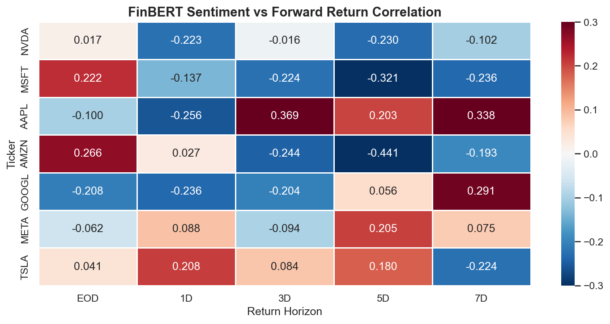

  **2. Delta Analysis**
  Measures per-day divergence between each LLM and FinBERT (e.g. `phi_delta = phi3_avg - finbert_avg`) and correlates those deltas with forward returns.
  - `phi_delta` and `llama_delta` are the most informative features — both strongly negative at 1D, meaning when LLMs are more bullish than FinBERT, next-day returns underperform (a contrarian signal)
  - `llama_delta` is the strongest single delta signal, persistently negative from 1D through 7D
  - `delta_sum` (all LLMs vs FinBERT combined) shows a positive 1D anomaly; collective disagreement may signal brief uncertainty that resolves upward
  - Raw cross-LLM spread (`llm_spread`) is near-neutral and uninformative on its own

  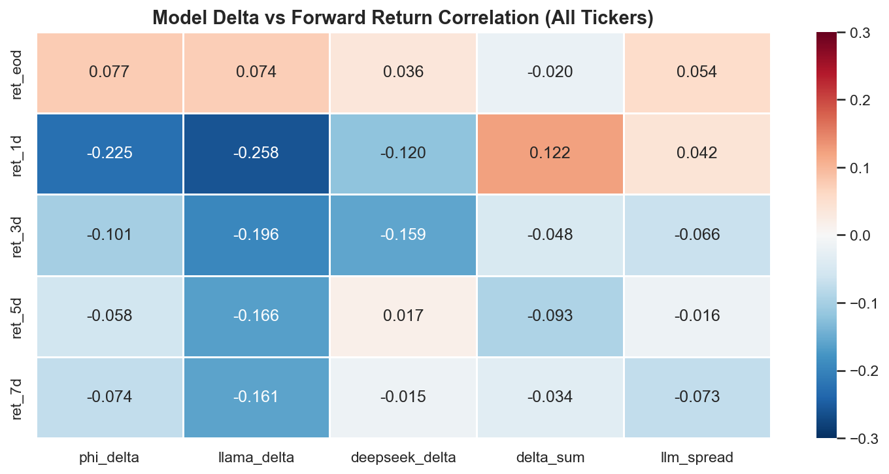

  **3. Quintile Analysis**
  Bins daily-average sentiment (and day-over-day sentiment change) into quintiles and plots mean excess forward return per quintile.
  - Neutral sentiment (Q3) outperforms all other quintiles at 3D–7D; sentiment extremes in either direction underperform
  - No monotonic Q1→Q5 pattern exists — the market does not reward increasingly positive sentiment at any horizon
  - Sentiment change (momentum) is more informative than level: moderate sentiment decline (Q2) is the strongest buy signal at 3D–7D; rising sentiment (Q4/Q5) acts as a contrarian sell signal

  *Sentiment level quintiles:*

  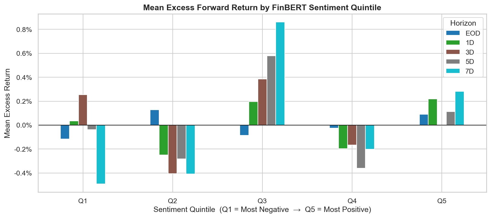
  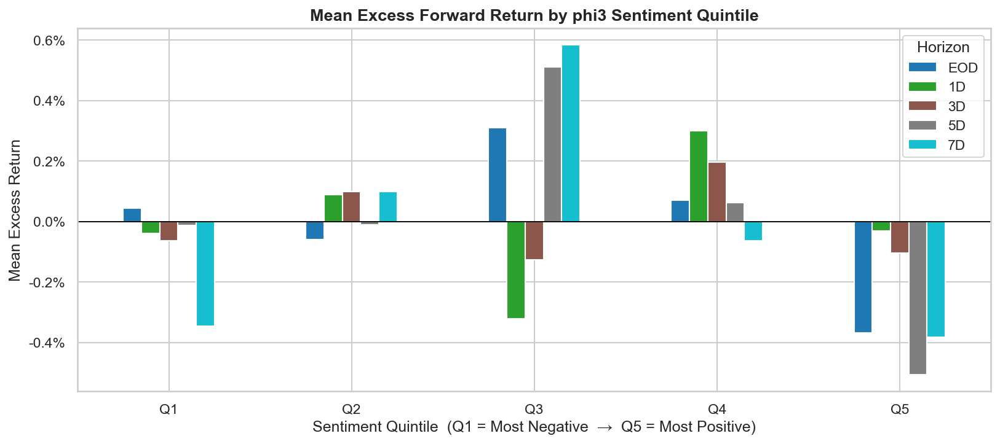
  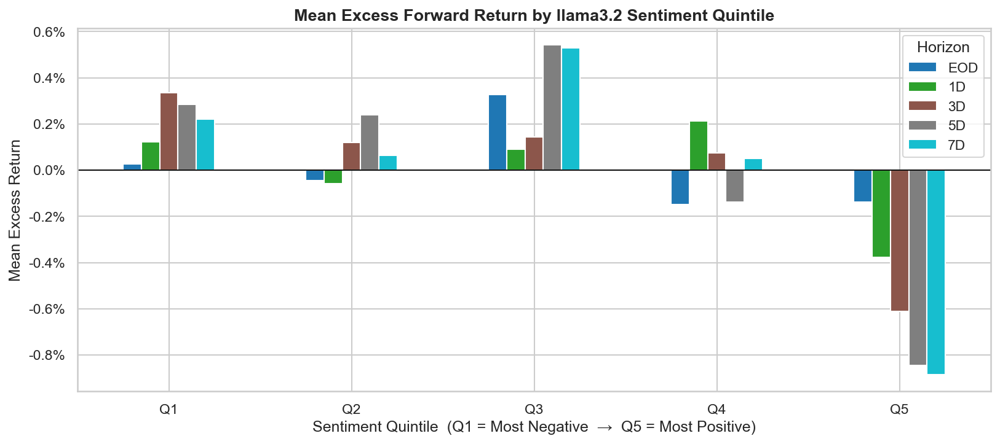
  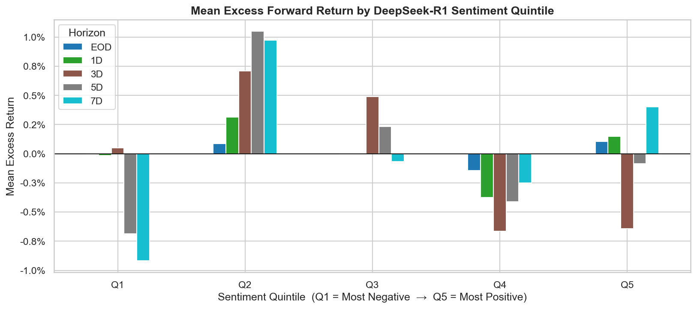

  *Sentiment change quintiles:*

  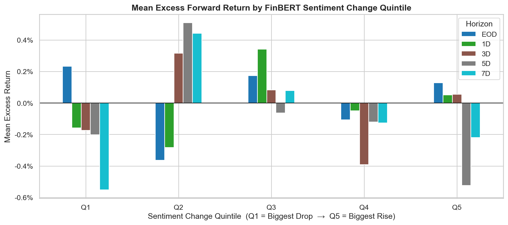
  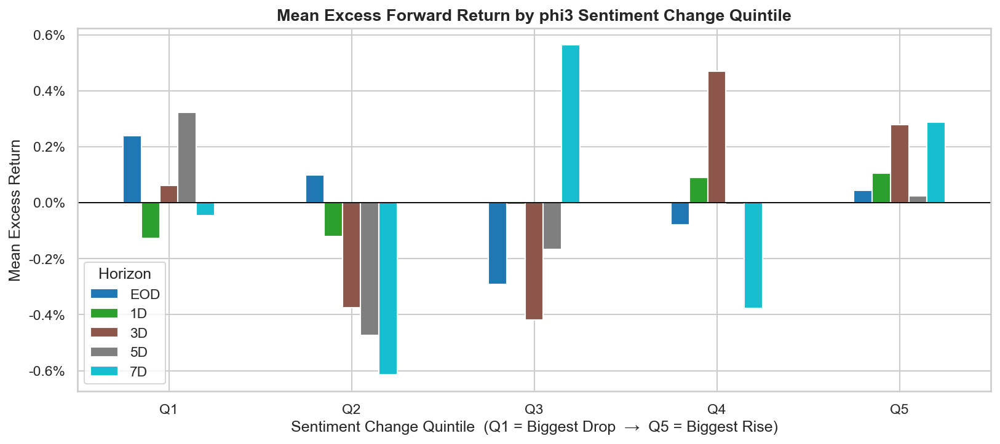
  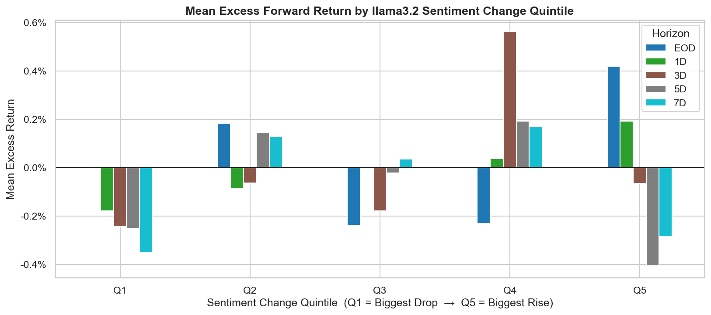
  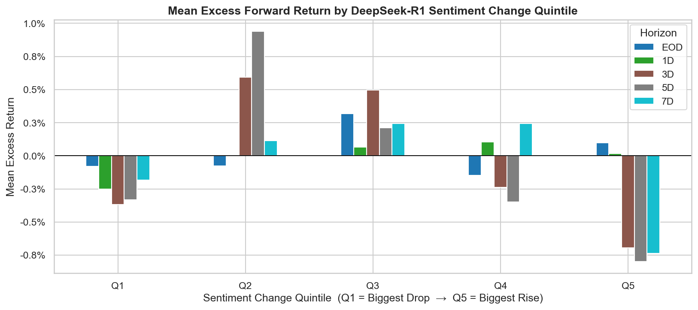

  **4. Hit Rate Analysis**
  Measures directional accuracy — how often the sign of daily-average sentiment correctly predicts the sign of forward returns.
  - All tickers and all horizons are below 50%; FinBERT sentiment is a consistent contrarian indicator
  - Hit rates worsen at longer horizons (e.g. MSFT drops from ~42% at EOD to ~14% at 7D)
  - The signal is most useful when inverted — treating high positive sentiment as a short-term bearish overlay is consistent across all four analyses

  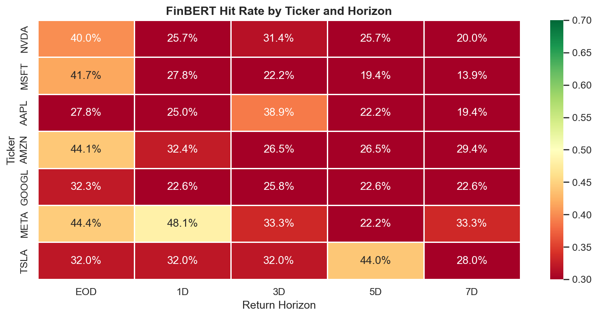
  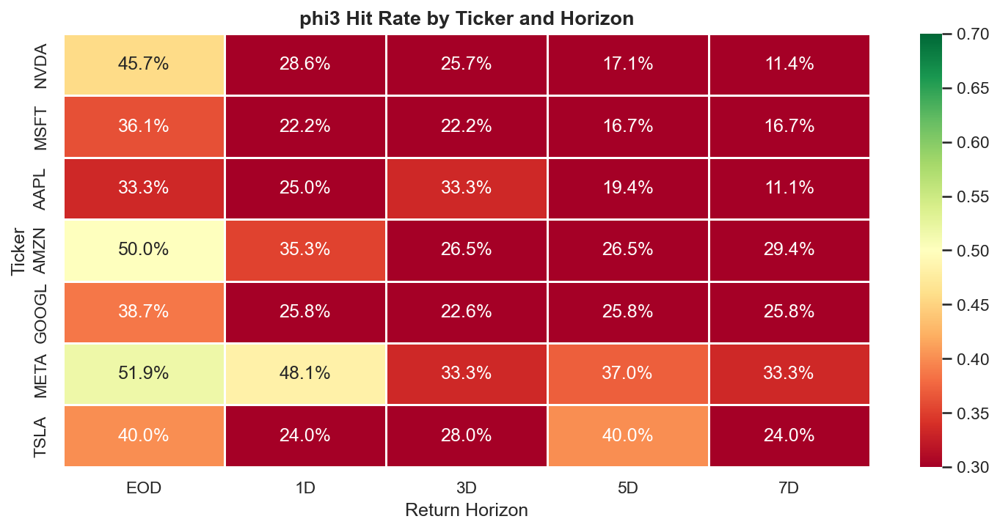
  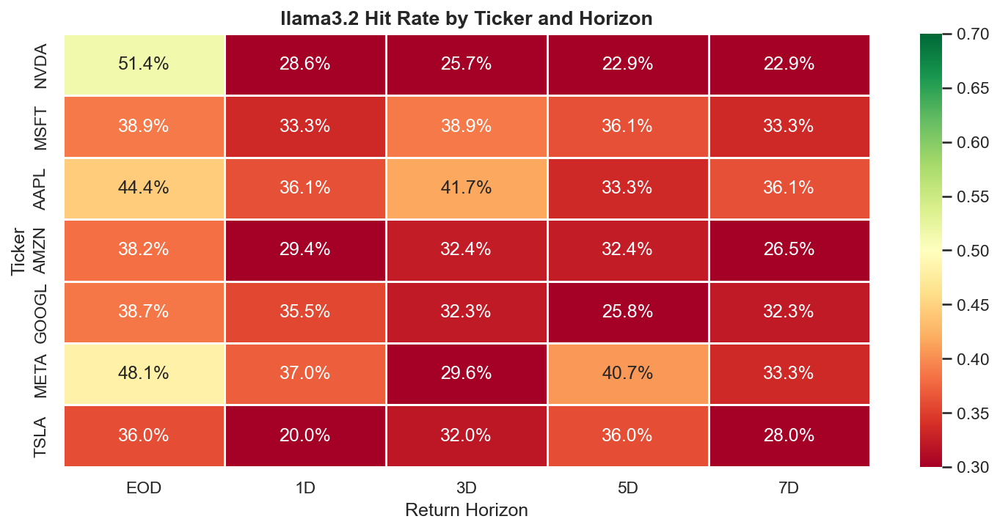
  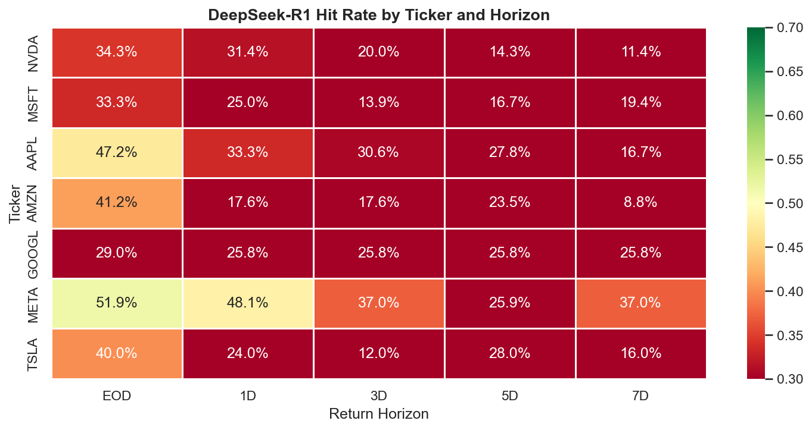

## Next Steps
- Re-run the full analysis with larger models (`qwen2.5:7b`, `llama3.1:8b`, `mistral:7b`) to test whether model quality improves sentiment-return correlations.
- Continue collecting data — current findings are based on ~35 days; patterns should be validated over 3–6 months before drawing strong conclusions.
- Explore predictive modeling (e.g. feature-based classifiers) once sufficient time-series data is available.

## Project layout

```text
mag-7-sentiment-signals/
  config/
    entities_global.yaml          # Global AI buzz phrases/entities, regulatory & macro terms
    relationships/                # One YAML per ticker (AAPL, MSFT, NVDA, etc.)
    secrets.env.example           # Template for optional NewsAPI key
  src/
    scrapers/                     # TechCrunch, NewsAPI Tech, Google News RSS scrapers
      base.py
      techcrunch.py
      google_news_rss.py
      newsapi_tech.py
    matching/                     # Match headlines to tickers and AI relevance (config-driven)
      config_loader.py
      matcher.py
      __init__.py
    sentiment/                    # FinBERT + Ollama sentiment; analyst prompt and pipeline
      finbert_scorer.py
      ollama_scorer.py
      pipeline.py
      __init__.py
    utils.py                      # Shared loaders (CSV/JSONL) and path helpers
  scripts/
    run_all_scrapers.py           # Run all three scrapers and write data/raw/headlines_YYYYMMDD.csv
    base_data.py                  # Raw → match → AI-only → dedupe → data/cleaned/base_data.csv
    run_process.py                # raw -> one processed file (match + sentiment)
    database.py                   # SQLite schema and helpers for sentiment_scores.db
  notebooks/
    sentiment_analysis.ipynb              # Ticker-level sentiment comparison across backends
    sentiment_timeseries - small.ipynb    # Sentiment-return analysis: correlations, deltas, quintiles, hit rates
    sentiment_testing.ipynb               # Earlier/scratch exploration for sentiment & flags
    database_testing.ipynb                # Experiments loading/querying the SQLite DB
    google_news_test.ipynb                # Google News RSS exploration
    newsapi_test.ipynb                    # NewsAPI Tech exploration
  data/
    raw/                          # Scraped headlines (headlines_YYYYMMDD.csv; legacy *.jsonl)
    cleaned/                      # processed_<suffix>.jsonl, base_data.csv
  visualizations/
    sentiment_scores.png          # Grouped barplot: average sentiment per ticker and model
    finbert_corr_by_ticker.png    # FinBERT sentiment-return correlation heatmap by ticker
    delta_corr_heatmap.png        # LLM-FinBERT delta vs return correlation heatmap
    quintile_finbert_level.png    # FinBERT sentiment level quintile excess returns
    quintile_phi3_level.png       # phi3 sentiment level quintile excess returns
    quintile_llama3_level.png     # llama3.2 sentiment level quintile excess returns
    quintile_deepseek_level.png   # DeepSeek-R1 sentiment level quintile excess returns
    quintile_finbert_change.png   # FinBERT sentiment change quintile excess returns
    quintile_phi3_change.png      # phi3 sentiment change quintile excess returns
    quintile_llama3_change.png    # llama3.2 sentiment change quintile excess returns
    quintile_deepseek_change.png  # DeepSeek-R1 sentiment change quintile excess returns
    hit_rate_finbert.png          # FinBERT directional hit rate heatmap by ticker and horizon
    hit_rate_phi3.png             # phi3 directional hit rate heatmap by ticker and horizon
    hit_rate_llama3.png           # llama3.2 directional hit rate heatmap by ticker and horizon
    hit_rate_deepseek.png         # DeepSeek-R1 directional hit rate heatmap by ticker and horizon
  .github/
    workflows/
      run-scrapers.yml            # CI: run scrapers on schedule / manual trigger
      base_data.yml                 # CI: update base_data.csv after scrapers
```

