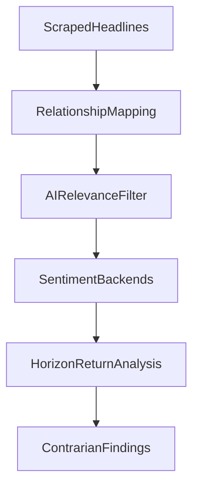

# Mag 7 AI Sentiment Pipeline

This project primarily tests how a traditional NLP baseline (FinBERT) compares to local small LLMs for headline sentiment classification in the Magnificent 7 (`NVDA`, `MSFT`, `AAPL`, `AMZN`, `GOOGL`, `META`, `TSLA`), especially in tasks where richer context can matter.

A secondary objective is testing whether those sentiment signals can help predict short-horizon stock returns, including whether the effect is directional or contrarian.

## Core Technical Idea

Headlines are not only tagged by direct ticker mentions. They are mapped through a relationship graph (aliases, products, subsidiaries, suppliers, partners, competitors), then scored by multiple sentiment backends, then aligned to forward returns at several horizons.


```mermaid
flowchart TD
    scrape[ScrapedHeadlines] --> match[RelationshipMapping]
    match --> aiFlag[AIRelevanceFilter]
    aiFlag --> sentiment[SentimentBackends]
    sentiment --> horizon[HorizonReturnAnalysis]
    horizon --> findings[ContrarianFindings]
```

## Relationship Mapping (Config-Driven)

The mapping layer is the core of ticker attribution and prompt context.

- **`config/entities_global.yaml`**: global AI relevance terms, macro/regulatory language, and broad entity phrases.
- **`config/relationships/<ticker>.yaml`**: ticker-specific identity and ecosystem mapping:
  - company aliases and subsidiaries (for better entity capture),
  - products and business lines,
  - ecosystem links (suppliers, partners, competitors) with optional keyword weighting.

This relationship context is used in two places:
1. Headline matching (`ticker`, `is_ai_related`) before sentiment scoring.
2. Prompt enrichment for LLM sentiment so model judgments are aware of who is affected in each headline.

## Setup and Models

### Python setup

```bash
python -m venv .venv
.venv\Scripts\activate          # Windows
# source .venv/bin/activate     # macOS/Linux
pip install -r requirements.txt
```

### Sentiment backends used

- `finbert` (baseline financial sentiment model)
- `phi3` (Ollama)
- `llama3.2:3b` (Ollama)
- `deepseek-r1:1.5b` (Ollama)

Pull local models:

```bash
ollama pull phi3
ollama pull llama3.2:3b
ollama pull deepseek-r1:1.5b
```

FinBERT-only quick run:

```bash
python scripts/run_process.py --backends finbert
```

## Web Scraping and Data Pipeline

### Sources

1. **TechCrunch** (RSS)
2. **NewsAPI Tech** (Top Headlines, requires key in `config/secrets.env`)
3. **Google News** (AI topic RSS)

### Minimal run path

1. Run scrapers (`scripts/run_all_scrapers.py`) -> writes/updates `data/raw/headlines_YYYYMMDD.csv`
2. Build base matched data (`scripts/base_data.py`) -> writes `data/cleaned/base_data.csv`
3. Score sentiment (`scripts/run_process.py`) -> writes `data/cleaned/processed_*.jsonl`

Key output sentiment fields are on `[-1, 1]` scale:
- `sentiment_finbert`
- `sentiment_llm_phi3`
- `sentiment_llm_llama3_2`
- `sentiment_llm_deepseek_r1`

<!-- ## Detailed workflow notes (de-emphasized for now)

**Automated (GitHub Actions)**  
Two workflows keep raw headlines and the aggregated master file updated:

1. **Run scrapers** (schedule or manual) — Runs `scripts/run_all_scrapers.py`; appends/merges into `data/raw/headlines_YYYYMMDD.csv` (one file per UTC day; second run that day dedupes by headline+url), then commits and pushes. Optionally uploads an artifact.
2. **Update base data** — Runs after scrapers complete (with a delay). Runs `scripts/base_data.py`: loads all raw files, runs ticker/AI matching, keeps **`is_ai_related == True`**, dedupes on **`(posted_at, url, ticker)`**, writes `data/cleaned/base_data.csv` (full rebuild each run), then commits and pushes.

**Local (manual)**  
3. **Run processing locally** — Run `python scripts/run_process.py` (or `--backends finbert` for FinBERT-only) to read `data/cleaned/base_data.csv`, apply sentiment, and write `data/cleaned/processed_<suffix>.jsonl`.

4. **Legacy JSONL -> CSV export** — If you still have old `headlines_*_*.jsonl` files: `python scripts/jsonl_to_csv.py …` / `--all-raw` writes copies under `data/csv/raw/`. New scrapes already save CSV in `data/raw/`.

5. **Normalize per-run CSVs to daily names** — If `data/raw/` has `headlines_YYYYMMDD_HH.csv` exports, run `python scripts/merge_raw_csv_to_daily.py` (optional `--dry-run`) to merge each day into `headlines_YYYYMMDD.csv` and remove the old files.
-->

## Findings (Current)

### 1) DeepSeek contrarian behavior

In ticker-level comparisons and spot-checks (especially `TSLA` and `META`), `deepseek-r1:1.5b` frequently takes more contrarian sentiment positions than FinBERT and other local LLMs.

Notebook inspection of raw model responses suggests this is mostly coherent reasoning differences (interpretation style) rather than parsing or pipeline errors.


### 2) Horizon behavior across tickers

Using `notebooks/sentiment_timeseries - small.ipynb`, daily average sentiment is aligned to forward returns at `EOD`, `1D`, `3D`, `5D`, and `7D`.

Observed pattern:
- `1D`: broadly contrarian across models/tickers.
- `3D-7D`: mixed behavior; some names (e.g., `AAPL`) shift positive while others remain contrarian.
- `MSFT`/`AMZN`: more persistently contrarian; `META`/`GOOGL`: stronger tendency to flip positive at longer horizons.


### 3) Persistent 1D negative correlation

The most stable effect so far is a persistent negative correlation between positive sentiment and next-day returns, consistent with a **buy the rumor, sell the news** dynamic: positioning happens ahead of the headline, then price mean-reverts or sells off after the sentiment event.

This dynamic is strongest at short horizon and weakens or changes sign as horizon extends.

<!-- ## Secondary analyses (hidden for now)

**Delta analysis (LLM vs FinBERT divergence):**
- `phi_delta` and `llama_delta` were the strongest negative 1D features.
- `llama_delta` stayed negative through longer horizons in current sample.


**Hit rate analysis:**
- Directional hit rates were below 50% across all horizons and models.
- Interpreted as sentiment being more useful when inverted (contrarian overlay).


-->

## Notebooks

- `notebooks/sentiment_analysis.ipynb`: backend comparison and DeepSeek behavior checks.
- `notebooks/sentiment_timeseries - small.ipynb`: horizon return alignment and correlation analysis.

## Next Steps
- Expand sample size and re-test whether the 1D contrarian effect remains stable out-of-sample.
- Re-run with larger models (`qwen2.5:7b`, `llama3.1:8b`, `mistral:7b`) to test whether model quality changes signal behavior.
- Evaluate simple invert-sentiment overlays as baseline trading hypotheses before more complex predictive models.

<!-- ## Project layout

```text
mag-7-sentiment-signals/
  config/
    entities_global.yaml          # Global AI buzz phrases/entities, regulatory & macro terms
    relationships/                # One YAML per ticker (AAPL, MSFT, NVDA, etc.)
    secrets.env.example           # Template for optional NewsAPI key
  src/
    scrapers/                     # TechCrunch, NewsAPI Tech, Google News RSS scrapers
      base.py
      techcrunch.py
      google_news_rss.py
      newsapi_tech.py
    matching/                     # Match headlines to tickers and AI relevance (config-driven)
      config_loader.py
      matcher.py
      __init__.py
    sentiment/                    # FinBERT + Ollama sentiment; analyst prompt and pipeline
      finbert_scorer.py
      ollama_scorer.py
      pipeline.py
      __init__.py
    utils.py                      # Shared loaders (CSV/JSONL) and path helpers
  scripts/
    run_all_scrapers.py           # Run all three scrapers and write data/raw/headlines_YYYYMMDD.csv
    base_data.py                  # Raw → match → AI-only → dedupe → data/cleaned/base_data.csv
    run_process.py                # raw -> one processed file (match + sentiment)
    database.py                   # SQLite schema and helpers for sentiment_scores.db
  notebooks/
    sentiment_analysis.ipynb              # Ticker-level sentiment comparison across backends
    sentiment_timeseries - small.ipynb    # Sentiment-return analysis: correlations, deltas, quintiles, hit rates
    sentiment_testing.ipynb               # Earlier/scratch exploration for sentiment & flags
    database_testing.ipynb                # Experiments loading/querying the SQLite DB
    google_news_test.ipynb                # Google News RSS exploration
    newsapi_test.ipynb                    # NewsAPI Tech exploration
  data/
    raw/                          # Scraped headlines (headlines_YYYYMMDD.csv; legacy *.jsonl)
    cleaned/                      # processed_<suffix>.jsonl, base_data.csv
  visualizations/
    sentiment_scores.png          # Grouped barplot: average sentiment per ticker and model
    finbert_corr_by_ticker.png    # FinBERT sentiment-return correlation heatmap by ticker
    delta_corr_heatmap.png        # LLM-FinBERT delta vs return correlation heatmap
    quintile_finbert_level.png    # FinBERT sentiment level quintile excess returns
    quintile_phi3_level.png       # phi3 sentiment level quintile excess returns
    quintile_llama3_level.png     # llama3.2 sentiment level quintile excess returns
    quintile_deepseek_level.png   # DeepSeek-R1 sentiment level quintile excess returns
    quintile_finbert_change.png   # FinBERT sentiment change quintile excess returns
    quintile_phi3_change.png      # phi3 sentiment change quintile excess returns
    quintile_llama3_change.png    # llama3.2 sentiment change quintile excess returns
    quintile_deepseek_change.png  # DeepSeek-R1 sentiment change quintile excess returns
    hit_rate_finbert.png          # FinBERT directional hit rate heatmap by ticker and horizon
    hit_rate_phi3.png             # phi3 directional hit rate heatmap by ticker and horizon
    hit_rate_llama3.png           # llama3.2 directional hit rate heatmap by ticker and horizon
    hit_rate_deepseek.png         # DeepSeek-R1 directional hit rate heatmap by ticker and horizon
  .github/
    workflows/
      run-scrapers.yml            # CI: run scrapers on schedule / manual trigger
      base_data.yml                 # CI: update base_data.csv after scrapers
``` -->

